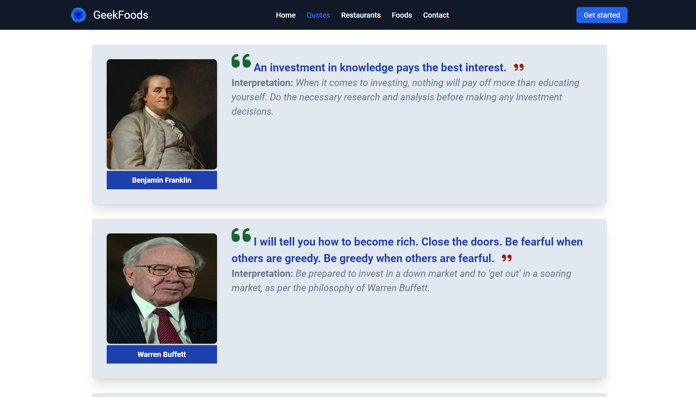

# M5React - Day4 Classwork Quotes


## Hosted Version of the Project:
[day-4-classwork-quotes-module5-react](https://day-4-classwork-quotes-module5-react.vercel.app/)

## Objective
In this project, i have taken on the task of building a Quote Page for using `ReactJS`. The Quote Page will be dedicated to displaying inspiring quotes from notable figures in the Stock Market. To achieve this, wie will create structured JSON data that includes quotes and writer names along with author images and interpretation of the quote. React's props mechanism and the map function will be employed to pass and display this quote data, providing website visitors with inspirational content.


## How to install and run on yours local machine
```bash
npm install
npm run start
```

## Tech. Stack Used:
+ [React](https://react.dev/)
+ [Google Fonts](https://fonts.google.com/)
+ [Font Awesome](https://fontawesome.com/icons/)

## Author
[Abhishek kumar](https://www.linkedin.com/in/alex21c/), ([Geekster](https://geekster.in/) MERN Stack FS-14 Batch)


